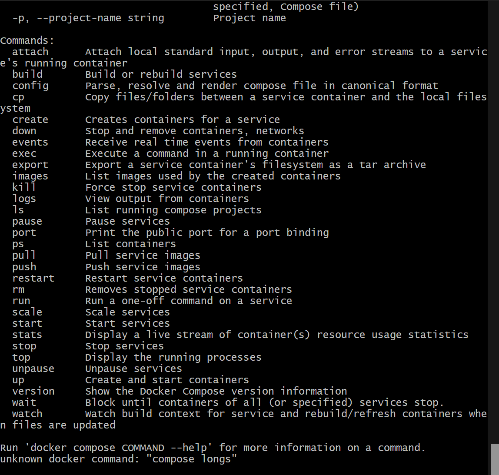
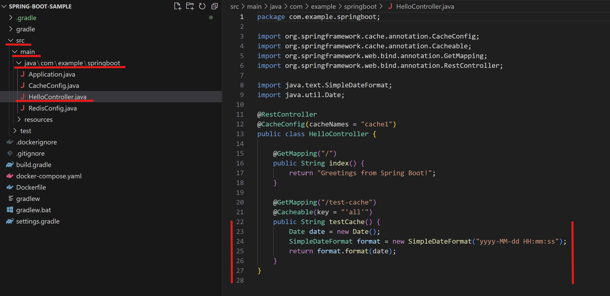
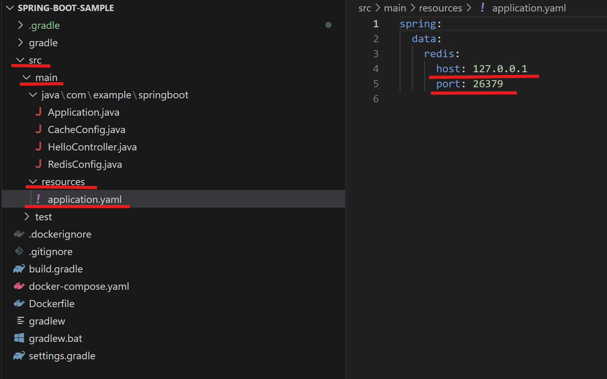
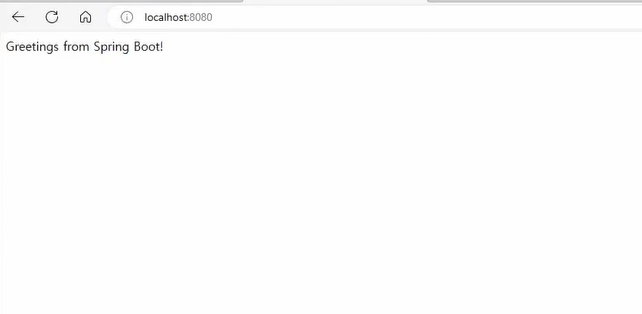
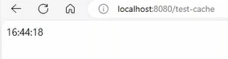
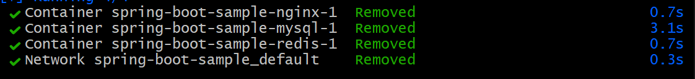

주어진 샘플 주소를 활용해서 Dockfile Compose가 개발환경에서 쓰이는 예제를 풀이해보자.
- 주어진 github 사이트 : https://github.com/nbcdocker/spring-boot-sample.git

1. 해당 코드를 clone 한다.
```
cd ~
git clone https://github.com/nbcdocker/spring-boot-sample.git

```

2. 해당 spring-boot-sample 파일에 들어가서 docker-compose로 실행한다. 
```
cd ~/spring-boot-sample
docker-compose up

```
- 위 명령어를 하게 되면, 필요한 Redis, NGINX, MySQL의 이미지를 pull 받게된다. 이후 다음 명령어를 실행시킨다.

```
docker-compose up -d
docker-compose logs -f
```
- `docker-compose up -d` : `docker-compose.yml` 파일에 정의된 서비스들을 실행하는 명령이다. 이 명령은 해당 서비스에 필요한 컨테이너들을 생성하고 시작한다. 만약 이미 실행 중인 컨테이너가 있다면, 해당 컨테이너를 다시 시작하거나 새로 빌드하여 실행한다.
- `docker-compose logs -f` : docker-compose.yml 파일에 정의된 서비스들의 로그를 출력하는 명령이다. 실행 중인 서비스에 대한 로그를 확인할 수 있다. 여러 서비스가 동시에 실행되는 경우, 각 서비스별 로그가 함께 출력된다.




3. 다운 받은 코드를 VS CODE로 실행한다.
- src -> main- > java -> HelloController.java라는 파일 내 cash 라인을 보면 현재 시간을 보여주는 코드로 되어 있다. 
- 현재 시간에 대한 응답을 5초마다 Eviction으로 저장하도록 되어있고, 이 함수를 호출하면 현재 시간을 돌려준다.


- src -> main- > resources -> Application.yaml에 로컬 호스트에 26379을 가리키도록 되어 있다.
    - docker-compose.yaml에서는 이미 docker-compose에 있는 6379번을 내 호스트에 26379로 맵핑시킨 것을 알 수 있다.


4. 정상적으로 build가 되었는지 확인해본다.
- EXPLORER : src -> main -> java -> Application.java
- GRADLE : GRABLE PROJECTS -> Tasks -> verification -> check 실행

5. 4번이 정상적인 작동이 되면, bootJar을 실행한다.

4,5 번이 정상적으로 작동된다면, Grable과 JDK 설정이 잘된 것을 확인할 수 있다.

6. Application.java 로 앱을 실행해서 잘 작동되는지 확인할 수 있다. 이를 localhost:8080로 접속하면 다음과 같다.


- 그리고 localhost:8080에서 test-cache를 실행시키면 (localhost:8080/test-cache) 현재 시간이 나오고, 5초 뒤에 변경이 되는 것을 확인할 수 있다.
즉, Redis가 동작하는 것을 확인할 수 있다.
    - Redis란? 인메모리 데이터 구조 저장소(in-memory data structure store)로, 데이터를 메모리(RAM) 상에 저장하여 빠른 데이터 접근을 제공한다. 일반적으로 데이터베이스, 캐시, 메시지 브로커 등 다양한 용도로 사용된다. Redis는 특히 성능이 중요한 애플리케이션에서 유용하게 사용된다.




---
7. git bash에 `docker-compose down`을 해서 Redis 실행을 중지한다.



- 이 상태에서 앱에 접속하면,  접속할 수 없다는 메세지가 뜬다.

---


