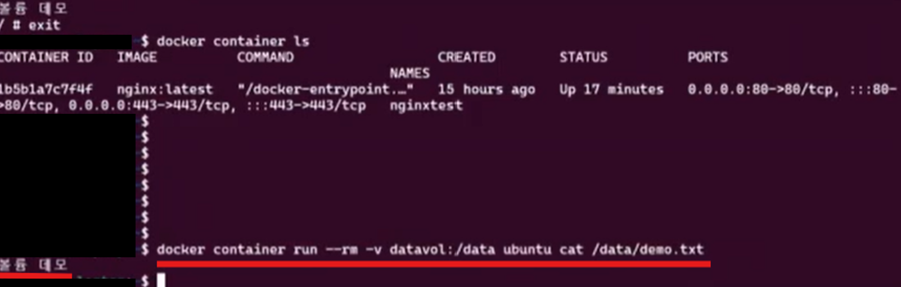
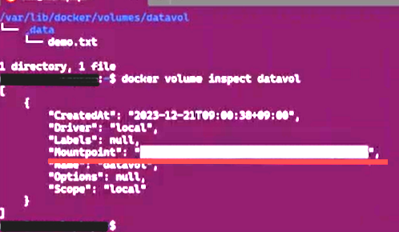
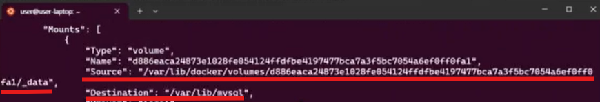
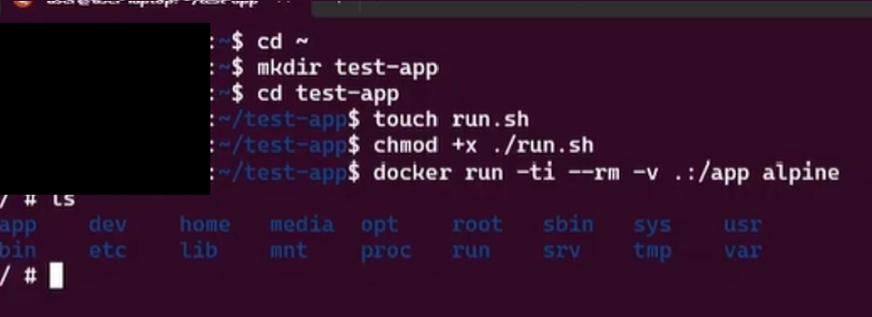
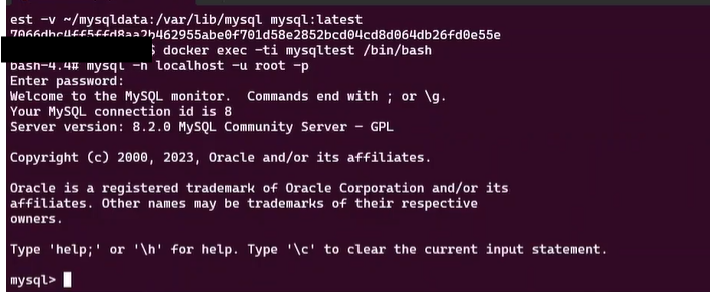

*보다 쉬운 이해를 위해 '#'를 사용해서 원리와 함께 명령어를 작성하였다.
*명령어를 terminal에 작성해야한다.

### 1. 데이터 영속성
Docker Volume에 이름을 특정한, 데이터 영속성을 이용한 예제이다.


```
# 1. 새로운 Docker 볼륨 'datavol' 생성
docker volume create datavol
# 이 명령은 Docker 볼륨을 생성하는 명령이다. 볼륨은 Docker 컨테이너와 호스트 시스템 간에 데이터를 저장하거나 공유할 수 있는 독립적인 저장소이다.

# 2. 현재 존재하는 Docker 볼륨 목록 확인
docker volume ls
# 이 명령은 생성된 모든 Docker 볼륨을 나열한다. 'datavol'도 목록에 표시된다.

# 3. Alpine 이미지를 사용해 새로운 컨테이너를 실행하고 'datavol' 볼륨을 /data 경로에 마운트(mount)
docker container run -ti --rm -v datavol:/data alpine
# 'alpine' 이미지를 기반으로 하는 컨테이너를 실행한다.
# '-ti'는 인터랙티브 모드와 터미널을 연결하여 명령어 실행을 할 수 있게 한다.
# '--rm' 옵션은 컨테이너 종료 시 자동으로 삭제되도록 한다.
# '-v datavol:/data'는 'datavol' 볼륨을 컨테이너의 /data 디렉토리에 마운트하여 컨테이너 내에서 데이터를 저장할 수 있게 한다.

# 4. 컨테이너 내에서 /data/demo.txt 파일에 데이터 작성
echo "볼륨 데모" > /data/demo.txt
# 이 명령은 컨테이너 내에서 /data 디렉토리에 demo.txt 파일을 만들고 "볼륨 데모"라는 텍스트를 기록한다.

# 5. 컨테이너에서 나가서 종료
exit
# 이 명령은 컨테이너의 셸을 종료하고 컨테이너를 종료한다.
# '--rm' 옵션에 의해 컨테이너는 종료 시 자동으로 삭제된다.

# 6. 현재 실행 중인 컨테이너 확인 (삭제된 컨테이너는 보이지 않음)
docker container ls
# 이 명령은 실행 중인 컨테이너를 나열합니다. 앞서 '--rm' 옵션으로 삭제된 컨테이너는 표시되지 않는다.

# 7. 새로운 Ubuntu 컨테이너에서 'datavol' 볼륨을 다시 마운트하고 demo.txt 파일 확인
docker container run --rm -v datavol:/data ubuntu cat /data/demo.txt
# 이제 Ubuntu 이미지를 사용해 새로운 컨테이너를 실행합니다.
# '-v datavol:/data'로 동일한 'datavol' 볼륨을 /data 디렉토리에 마운트한다.
# 'cat /data/demo.txt' 명령으로 /data/demo.txt 파일을 읽어, 이전에 작성한 "볼륨 데모" 텍스트를 출력한다.
# '--rm' 옵션으로 컨테이너가 종료되면 자동으로 삭제된다.


```

풀어서 작성하자면, 
- 1. docker volume create 명령으로 Docker 볼륨을 생성한다. 
- 2. 컨테이너 실행 시 볼륨 마운트한다. 
    - `-v datavol:/data` 옵션을 통해 `datavol`이라는 볼륨을 컨테이너의 `/data` 디렉토리에 연결한다. 이로 인해 컨테이너 내에서 `/data` 디렉토리로 저장되는 모든 데이터는 호스트의 datavol 볼륨에 저장된다.

- 3. 데이터 저장: 컨테이너 내에서 텍스트 파일을 생성하여 데이터를 기록하면, 해당 파일은 실제로 볼륨에 저장된다. 컨테이너 종료 후에도 이 데이터는 사라지지 않고 볼륨에 유지된다.

- 4. 다시 접근: 새로운 컨테이너를 실행할 때 동일한 볼륨을 마운트하면, 이전 컨테이너에서 저장한 데이터에 다시 접근할 수 있다. 이 방식은 데이터가 컨테이너의 수명에 의존하지 않고, 지속적으로 유지되도록 한다.





---
- host machine 의 디렉토리 확인
```
sudo apt update; sudo apt install -y tree; # 시스템의 패키지 목록을 최신 상태로 갱신하여 최신 소프트웨어 버전 정보를 다운로드 후, tree 명령어를 설치하여 디렉토리 구조를 트리 형태로 시각화할 수 있게 만든다.
sudo tree -a /var/lib/docker/volumes/datavol #Docker 볼륨이 저장된 경로의 디렉토리 구조를 트리 형태로 출력하며, 숨김 파일도 포함하여 모두 표시한다.
```


- inspect 명령으로 volume 확인

```
docker volume inspect datavol  # inspect 명령으로 volume 확인
[
    {
        "CreatedAt": "2024-12-11T14:33:11+09:00",  # 볼륨이 생성된 시간 (2024년 12월 11일 오후 2시 33분 11초)
        "Driver": "local",  # 볼륨을 관리하는 드라이버. 'local'은 호스트 시스템의 로컬 파일 시스템을 사용
        "Labels": null,  # 라벨이 설정되지 않음 (라벨을 사용하여 볼륨을 분류하거나 태그할 수 있음)
        "Mountpoint": "/var/lib/docker/volumes/datavol/_data",  # 실제로 볼륨 데이터가 저장된 경로
        "Name": "datavol",  # 볼륨의 이름 (이 경우 'datavol')
        "Options": null,  # 옵션이 설정되지 않음 (볼륨 생성 시 추가 설정이 없음)
        "Scope": "local"  # 볼륨의 범위. 'local'은 현재 Docker 호스트에서만 사용됨
    }
]
```

마운트된 위치를 알 수 있다.


---

### 2. 데이터 암시성
Docker Volume의 이름을 특정하지 않는, 데이터 암시성을 이용한 예제이다.

```
# MySQL 컨테이너를 백그라운드에서 실행한다.
# -d: 백그라운드 모드로 실행 (detached mode)
# --name mysqltest: 컨테이너 이름을 'mysqltest'로 지정
# -v /var/lib/mysql: 호스트의 '/var/lib/mysql' 디렉토리를 컨테이너에 마운트 (MySQL 데이터 저장소)
# mysql:latest: 'mysql' 이미지를 사용하고 최신 버전으로 실행
docker run -d --name mysqltest -v /var/lib/mysql mysql:latest  #  mysqltest라는 이름의 MySQL 컨테이너 실행, /var/lib/mysql 디렉토리를 마운트하여 데이터 저장소로 사용

# 실행 중인 컨테이너 'mysqltest'의 정보를 확인한다.(정보가 너무 많음)
# 'docker inspect' 명령어는 컨테이너의 모든 정보를 JSON 형식으로 출력한다.
docker inspect mysqltest  # 컨테이너의 상세 정보를 출력
# 해당 컨테이너의 모든 정보를 출력하여, 볼륨, 네트워크, 설정 등을 확인할 수 있다.

# 'docker inspect' 명령어의 출력 결과에서 'Mounts' 정보만 필터링하여 볼 수 있다.
# 'jq .[].Mounts'는 JSON 결과에서 'Mounts' 배열을 추출하여 볼륨 관련 정보를 확인하는 방법이다.
docker inspect mysqltest | jq .[].Mounts  # 컨테이너의 'Mounts' 정보 (볼륨 정보)만 출력, 실제 마운트된 볼륨 정보만 확인

# 시스템에 존재하는 모든 Docker 볼륨 목록을 확인한다.
# 'docker volume ls'는 모든 볼륨의 이름을 출력하여, 해당 컨테이너가 '현재' 사용하는 볼륨을 확인하는 데 유용하다.
docker volume ls  # 시스템에 있는 모든 Docker 볼륨 목록을 출력

```
source에 사진과 같은 디렉토리가 mysql container에 마운트된 것을 알 수 있다.
이름이 암시적으로 되어있기에, Docker가 지정한 것을 확인할 수 있다.



----

### 3. bind mount를 사용해서 디렉토리 mount
`test-app`이라는 디렉토리를 만든 후, run이라는 파일을 생성하고 들어가서, run이라는 파일에 실행 권한을 준다. 이후 현재 디렉토리를 app이란 디렉토리에 mount 시킨 후, alpine Linux를 실행시킨다.
```
cd ~
mkdir test-app
cd test-app
touch run.sh
chmod +x ./run.sh
docker run -ti --rm -v .:/app alpine
```



```
# 앱디렉토리를 들어가면, run.sh 파일이 같이 있는 것을 확인할 수 있다.(docker container 내부에서 run.sh 존재 확인)
cd /app
ls -ahlvF

# 종료 시 `exit` 명령어를 작성하면 된다.
```
---

### 4. readonly와 readwrite(default) 디렉토리 마운트
bind 마운트는 readonly와 readwrite(default)를 같이할 수 있는 디렉토리를 설정할 수 있다.
```
# 1. 홈 디렉토리에서 
mkdir readonly  # 'readonly' 디렉토리 생성
mkdir readwrite  # 'readwrite' 디렉토리 생성

# 2. Docker 컨테이너를 실행하며 두 개의 볼륨을 호스트 시스템에서 컨테이너로 마운트
# - `~/readonly:/readonly:ro`: 호스트 시스템의 ~/readonly 디렉토리를 컨테이너의 /readonly 디렉토리에 '읽기 전용(ro)'로 마운트
# - `~/readwrite:/readwrite:rw`: 호스트 시스템의 ~/readwrite 디렉토리를 컨테이너의 /readwrite 디렉토리에 '읽기/쓰기(rw)'로 마운트
# - `ubuntu`: Ubuntu 이미지를 사용하여 컨테이너를 실행
docker run -ti -v ~/readonly:/readonly:ro -v ~/readwrite:/readwrite:rw ubuntu

# 3. Docker 컨테이너 내부에서 실행되는 명령어
# - '/readonly/readonly.txt' 파일에 내용을 쓰려고 시도하지만, 해당 디렉토리는 '읽기 전용(ro)'로 마운트되어 있어서 실패
echo "test" > /readonly/readonly.txt  # 읽기 전용 디렉토리에서 파일 쓰기 시도 (실패)

# - '/readwrite/readwrite.txt' 파일에 내용을 쓰면, 해당 디렉토리는 '읽기/쓰기(rw)'로 마운트되어 있으므로 파일 쓰기가 가능
echo "test" > /readwrite/readwrite.txt  # 읽기/쓰기 디렉토리에서 파일 쓰기 (성공)

# 4. Docker 컨테이너에서 나와 호스트 시스템으로 돌아간다.
exit  # 컨테이너 종료

# 5. 호스트 시스템에서 'readwrite' 디렉토리 내의 파일 내용을 출력한다.
# - /readwrite/readwrite.txt 파일에 "test"라는 내용이 기록되었으므로, 이 파일을 호스트 시스템에서 확인할 수 있다.
cat ~/readwrite/readwrite.txt  # 호스트 시스템에서 'readwrite.txt' 내용 출력 (출력: "test")

```

결론은 다음과 같다. 
- Docker에서는 볼륨을 컨테이너에 마운트할 때 읽기 전용(ro) 및 읽기/쓰기(rw) 옵션을 설정할 수 있다.
- `~/readonly` 디렉토리는 읽기 전용으로 마운트되어 파일을 쓸 수 없고, `~/readwrite` 디렉토리는 읽기/쓰기 모드로 마운트되어 파일을 쓸 수 있다.
- 컨테이너 내에서 데이터를 readwrite 디렉토리에 쓴 후, 호스트 시스템에서 해당 데이터를 확인할 수 있다.


---

### 5. mysql 데이터를 보존해서 실행하기
mysql를 직접 실행해서 Container가 데이터를 보존하면서 실행되는지 확인해보는 예제이다. 


```
# MySQL 컨테이너 실행
# -ti: 대화형 터미널 모드로 실행
# --rm: 컨테이너 종료 시 자동으로 컨테이너를 삭제
# -d: 백그라운드 실행
# --name mysqltest: 컨테이너 이름을 'mysqltest'로 설정
# -e MYSQL_ROOT_PASSWORD=123!: MySQL root 사용자 비밀번호를 설정
# -e MYSQL_DATABASE=mysqltest: 'mysqltest'라는 데이터베이스를 생성
# -v ~/mysqldata:/var/lib/mysql: 호스트의 ~/mysqldata 디렉토리를 컨테이너의 MySQL 데이터 디렉토리인 /var/lib/mysql에 마운트
# mysql:latest: MySQL 최신 버전 이미지 사용
docker run -ti --rm -d --name mysqltest -e MYSQL_ROOT_PASSWORD=123! -e MYSQL_DATABASE=mysqltest -v ~/mysqldata:/var/lib/mysql mysql:latest
```

```
# mysqltest 컨테이너 내부에 bash로 접속
# -ti: 대화형 터미널 모드로 접속
docker exec -ti mysqltest /bin/bash  # 컨테이너 내 bash 쉘에 접속

# MySQL에 접속
# -h localhost: MySQL 서버 주소를 localhost로 설정 (컨테이너 내에서 localhost로 접속)
# -u root: MySQL의 root 사용자로 로그인
# -p: 비밀번호를 입력하도록 요구 (123! 비밀번호를 입력)
mysql -h localhost -u root -p  # MySQL에 로그인
```

```
# MySQL 명령어 예시
# show databases: 현재 MySQL 서버의 모든 데이터베이스 목록을 조회
show databases;  # 데이터베이스 목록 조회

# mysqltest 데이터베이스 선택
use mysqltest;  # 'mysqltest' 데이터베이스 사용

# mysqltest 데이터베이스에 테이블 생성
create table mysqltest(id int, name varchar(50));  # 'mysqltest' 테이블 생성 (id와 name 필드)

# 데이터 삽입
insert into mysqltest values(1, 'testname');  # 테이블에 데이터 삽입

# 데이터 조회
select * from mysqltest;  # 테이블의 모든 데이터를 조회

# Ctrl+D: MySQL 클라이언트 종료 및 Bash 쉘 종료
```

```
# MySQL과 SSH 접속 상태에서 컨테이너 내 MySQL 데이터 파일을 확인
ls -ahlvF /var/lib/mysql/mysqltest  # 'mysqltest' 테이블에 해당하는 데이터 파일 목록 확인

# Bash 쉘 종료
exit  # 컨테이너 내 Bash 쉘 종료
```

```
# 동일한 데이터를 사용하는 다른 MySQL 컨테이너 실행
# mysqltest 컨테이너를 중지
docker stop mysqltest  # mysqltest 컨테이너 종료

# 동일한 데이터 디렉토리를 마운트하여 새로운 MySQL 컨테이너 실행
# -v ~/mysqldata:/var/lib/mysql: 이전 컨테이너에서 사용한 데이터를 마운트하여 동일한 데이터를 사용할 수 있게 함
docker run -ti --rm -d --name mysqltest2 -e MYSQL_ROOT_PASSWORD=123! -e MYSQL_DATABASE=mysqltest -v ~/mysqldata:/var/lib/mysql mysql:latest

# mysqltest2 컨테이너의 로그를 실시간으로 확인
docker logs -f mysqltest2  # 컨테이너의 로그를 실시간으로 확인

# mysqltest2 컨테이너 내부에 sh로 접속
docker exec -ti mysqltest2 /bin/sh  # 새로운 컨테이너에 쉘로 접속

# mysqltest2 컨테이너에서 MySQL에 접속
mysql -h localhost -u root -p  # mysqltest2에서 MySQL 로그인

# mysqltest 데이터베이스 선택
use mysqltest;  # 'mysqltest' 데이터베이스 선택

# mysqltest 데이터베이스에서 데이터 조회
select * from mysqltest;  # 기존에 삽입한 데이터 확인 (예: 'testname')
```
결론적으로 다음과 같다.
- 두 개의 MySQL 컨테이너를 사용하여 동일한 데이터 파일을 공유한다.
- 첫 번째 컨테이너에서 데이터를 삽입한 후, 해당 데이터를 두 번째 컨테이너에서도 동일하게 사용할 수 있음을 확인한다.
- 데이터는 호스트 시스템의 `~/mysqldata` 디렉토리에 저장되어 컨테이너가 종료되어도 지속되는 것을 확인할 수 있다.


- `root password`는 명령어 속에 `123!`이라고 주어져있다. 따라 작성하면 다음과 같은 화면이 보이는 것을 다음 사진으로 참고하면된다.



---
### 참고자료
docker 실행 시 환경 변수 변경가능한 리스트 모음 사이트 : https://hub.docker.com/_/mysql


----
Docker Volume을 공부하기 전, 가볍게만 생각한 기능이었는데, 생각보다 매우 중요한 기능인 점을 깨닫게 되었다. 그렇게되면 다음 공부할 `Docker Network`도 연관되어 중요하지 않을까 생각이 들었다.