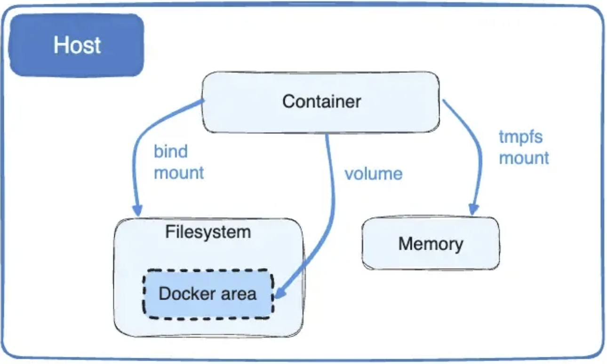

## Docker Volume이란?
Docker 볼륨(Docker Volume)은 컨테이너와 호스트 간에 데이터를 영구적으로 저장하고 공유할 수 있는 방법이다. Docker에서 볼륨은 데이터의 저장소 역할을 하며, 컨테이너가 종료되거나 삭제되더라도 데이터를 유지할 수 있도록 해준다.

- Docker는 보통 볼륨을 컴퓨터의 특정 폴더 (대부분 **`/var/lib/docker/volumes/`**라는 곳) 에 만들어진다.

---

### Docker 볼륨의 장점

- **백업 이점**: 볼륨은 데이터를 다른 곳으로 옮기거나 백업하기 편하다.
- **Docker 명령어로 관리**: 컴퓨터에 있는 Docker 프로그램 명령어나 인터넷으로 연결된 API를 써서 볼륨을 관리할 수 있다.
- **어디서나 잘 작동**: 볼륨은 리눅스나 윈도우, 어떤 컨테이너에서도 잘 작동한.
- **여러 컨테이너에서 안전하게 사용가능**: 볼륨은 여러 컨테이너가 같이 쓰기에도 안전하게 만들어져 있다.
- **볼륨 드라이버로 더 많은 기능을 추가가능**: 볼륨 드라이버를 쓰면 데이터를 다른 곳에 저장하거나 보안을 강화하는 등 여러 기능을 추가할 수 있다.
- **Mac이나 Windows에서 더 빠르게 사용**: Mac이나 Windows 컴퓨터에서 Docker를 쓸 때 볼륨이 기본 저장 방식보다 훨씬 빠르게 돌아간다.

이렇게 볼륨을 쓰면 데이터를 더 잘 다루고, 여러 컨테이너에서 공유하거나, 데이터를 안전하게 관리하는데 도움된다.

---

### Docker 볼륨을 사용하는 이유
- **데이터 영속성**: 컨테이너(Container)는 쓰고 나면 사라지는데, 볼륨을 쓰면 컨테이너가 사라져도 데이터는 그대로 남는다.
- **같은 데이터를 여러 컨테이너가 사용 가능**: 볼륨 덕분에 여러 컨테이너가 같은 데이터를 함께 쓸 수 있다. 이렇게 하면 데이터를 여기저기 복사할 필요가 없다.
- **데이터 백업하고 옮기기 쉬운 점**: 볼륨을 쓰면 데이터를 백업하거나 다른 컴퓨터로 옮기기가 편해진다.
- **속도**: 때로는 볼륨을 쓰는 게 데이터를 더 빠르게 처리할 수 있게 해준다. 특히 많은 양의 데이터를 다룰 때 유용하다.
- **더 안전한 데이터 보관**: 볼륨을 사용하면 중요한 데이터를 컨테이너 밖에 따로 안전하게 보관할 수 있다.
- **코드와 데이터를 분리 유지**: 볼륨을 쓰면 코드를 바꿔도 데이터는 그대로 유지할 수 있어서, 개발이나 운영할 때 편리하다.
- Docker 공식 사이트에서는 volume, bind mount, tmpfs mount 중에 volume을 가장 추천한다. (아래 설명 참고)

출처 : https://docs.docker.com/storage/volumes/
- 사진에서와 같이 Cotnainer를 bind mount 또는 volume(대신 특정 공간)으로 Filesystem에, tmpfs mount로 Memory에 활용된다.

---

### 추가적인 내용
**1. bind mount** 
- 바인드 마운트(bind mount)는 컴퓨터의 특정 폴더나 파일을 Docker 컨테이너 안에서 직접 쓸 수 있게 해주는 것이다. 볼륨보다 기능이 좀 덜하지만, 특정 상황에서 유용하다. 많이 사용된다고한다.
- 컴퓨터에서 어떤 폴더나 파일을 골라서 Docker 컨테이너에 '붙여넣는' 것과 비슷하다. 컨테이너 안에서도 그 파일이나 폴더를 마치 자기 것처럼 쓸 수 있다.
- 바인드 마운트는 컴퓨터 안의 정확한 위치(절대 경로)에 있는 파일이나 폴더를 사용한다. 컨테이너가 어디에 있든, 그 파일이나 폴더를 똑같이 쓸 수 있다.
- 즉, 바인드 마운트를 사용하면 컨테이너에서 컴퓨터의 특정 파일이나 폴더를 쉽게 접근하고 사용할 수 있다. 이런 방식은 특정 개발 작업이나 데이터를 다룰 때 도움이 될 수 있다.

**2. tmpfs mount**
- tmpfs 마운트(tmpfs mount)는 컴퓨터 메모리를 사용해서 일시적인 데이터를 저장하는 방법이다. 컨테이너 안에서 잠깐 필요한 데이터를 다룰 때 유용하다.
- 일시적인 데이터 저장, 컴퓨터의 파일 시스템을 사용하지 않고 대신 메모리를 사용하는 이점, 이에 데이터를 빠르게 읽고 쓸 수가 있어서 컨테이너 성능 향상, 다른 컨테이너끼리 공유가 안되는 특징을 가지고 있다.
- 즉 tmpfs 마운트는 컨테이너가 잠깐 필요한 데이터를 메모리에 저장하고 싶을 때 사용하면 좋다. 데이터를 빠르게 처리할 수 있고, 컨테이너가 끝나면 자동으로 데이터도 사라져서 사용에 편리하다.

---

