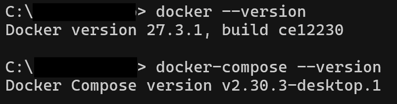
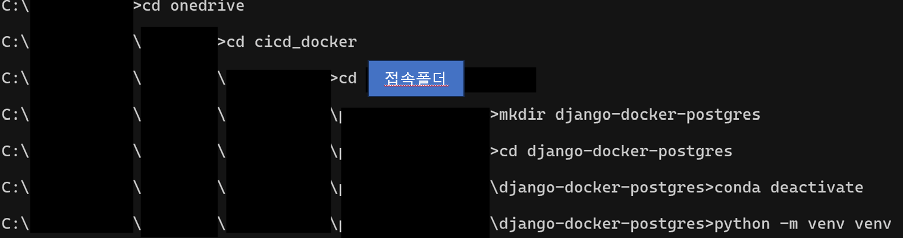
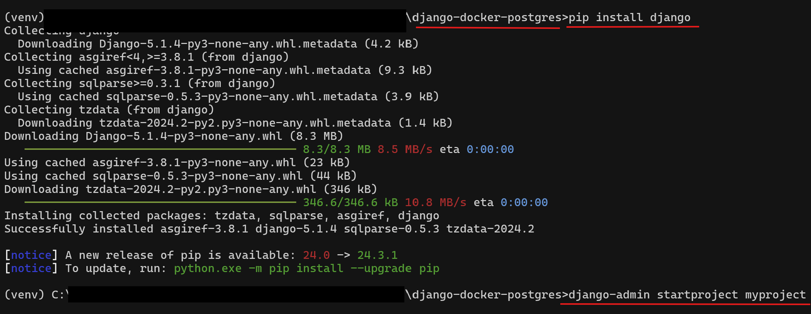
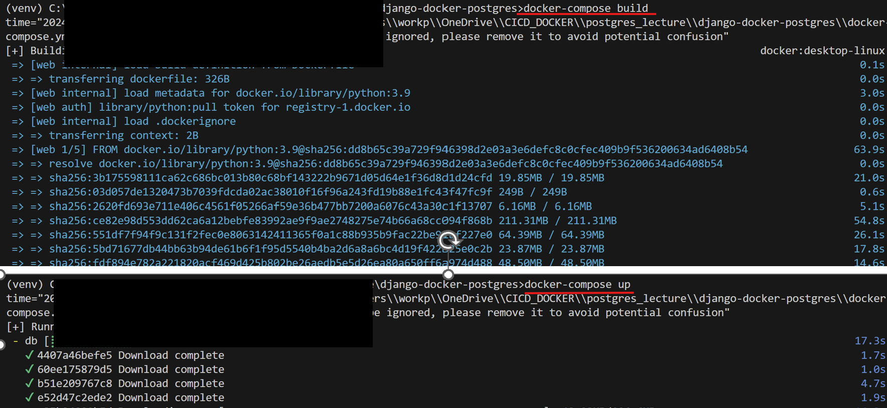
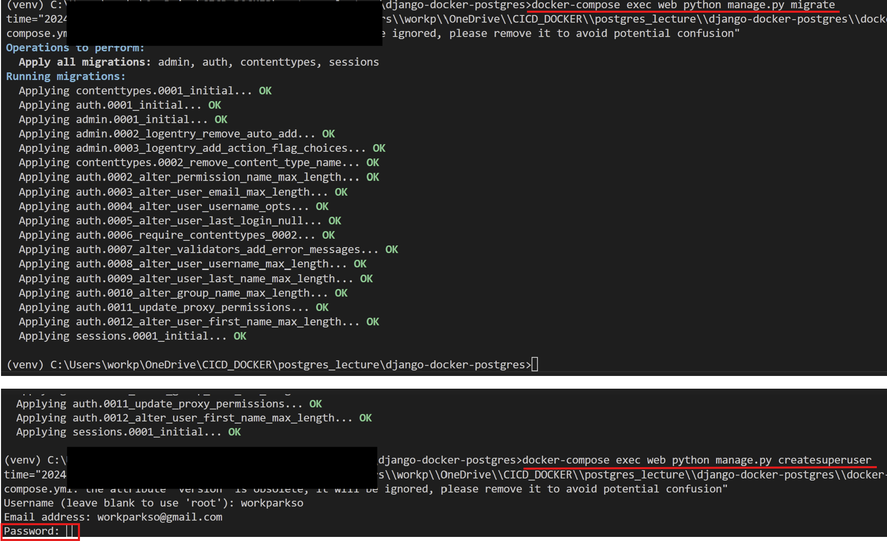
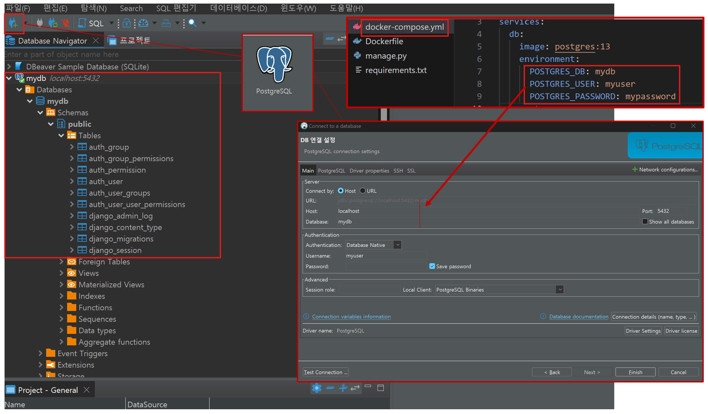

- Docker Compose로 Django와 Postgres 연결하는 것을 목표로 둔다.

### 1. Docker Compose란?
**컨테이너 오케스트라이제이션(Container Ochestrzation)**로, **여러 컨테이너를 정의하고 실행할 수 있는 도구**이다.

- Docker Compose 장점
    - 복잡한 다중 컨테이너 애플리케이션을 쉽게 관리
    - 코드 기반으로 환경 설정(docker-compose.yml)
    - 컨테이너 간 네트워크 자동 구성

### 2. Docker Compose 설치

- **설치 방법**
    - **Windows / MacOS**: **Docker Desktop**에 **포함**되어 있음
    - **Linux**:
    ```
    sudo curl -L "https://github.com/docker/compose/releases/latest/download/docker-compose-$(uname -s)-$(uname -m)" -o /usr/local/bin/docker-compose
    sudo chmod +x /usr/local/bin/docker-compose
    ```


- Docker 기존에 설치했기에 설치를 확인한다.
    - **Docker desktop 꼭 실행 후** 터미널에 코드 작성한다.
```
docker --version
docker-compose --version
``` 


---

### 3. Docker Compose 기본 사용법
docker-compose.yml 아래와 같은 구조로 되어있다.
**이는 예시일 뿐**, 일런 형태라는 것을 익혀두고 본격적으로 들어가려고한다.

- docker-compose.yml 예시 파일 
```
services:
  db:
    image: postgres:13
    environment:
      POSTGRES_DB: mydb
      POSTGRES_USER: myuser
      POSTGRES_PASSWORD: mypassword
    ports:
      - "5432:5432"
    volumes:
      - postgres_data:/var/lib/postgresql/data

  web:
    build: .
    command: python manage.py runserver 0.0.0.0:8000
    volumes:
      - .:/app
    ports:
      - "8000:8000"
    depends_on:
      - db
volumes:
  postgres_data:

```
- 네크워크 및 볼륨 설정
```
volumes:
  postgres_data:
 ```

- 관련 **명령어** (터미널에 검색색)
    - `docker-compose up` : 컨테이너들 **실행**
    - `docker-compose down` : 컨테이너들 **종료 및 삭제**
    - `docker-compose logs` : 로그 확인

----

### 4. Django와 Postgres 연결 실습

Docker desktop를 켜두고, VS code와 CMD 창을 준비해둔다. 

#### 1. 프로젝트 준비
- Django 프로젝트 생성
```
mkdir django-docker-postgres # 폴더 만들기
cd django-docker-postgres # 폴더에 들어가기
conda deactivate # conda 사용하는 사람들은 꼭 해줘야하는 것
python -m venv venv  # 가상환경 생성
venv\\Scripts\\activate.bat # windows는 이렇게, MacOS는 source venv/bin/activate
pip install django #django 설치
django-admin startproject myproject . # Django의 myproject 만들어서 본격적인 프로젝트 준비하기  

```



#### 2. Dockerfile 작성
- 프로젝트 루트에 Dockerfile 생성
- Dockerfile을 만들어진 'django-docker-postgres'에 만들고 아래 코드를 작성한다.

```
# Dockerfile #dockerhub에서 pytho 3.9 이미지를 가져온다.
FROM python:3.9

# 작업 디렉토리 설정/ app이라는 폴더를 컨테이너 안에다가 만들고, 거기로 이동한다.
WORKDIR /app 

# 의존성 설치/ requirements.txt를 app 폴더 안으로 옮긴다.
COPY requirements.txt . 

# pip install해서 requirements.txt를 설치한다.
RUN pip install --no-cache-dir -r requirements.txt 

# 지금 django-docker-postgres 폴더를 컨테이너 app 폴더로 복사한다.
COPY . .

# 서버 실행/ python manage.py runserver를 하기위해, 8000번 포트에 대한 외부 접속을 허용한다.
CMD ["python", "manage.py", "runserver", "0.0.0.0:8000"]
```


#### 3. requirements.txt 작성
requirements.txt 파일을 만들어 아래 코드를 작성한다.
    - requirement's'인 점 주의하자.
```
asgiref==3.8.1
Django==4.1.2
sqlparse==0.5.3
psycopg2-binary
```


#### 4. docker-compose.yml 작성
- docker-compose.yml 파일 생성 후 아래 코드를 작성한다.

```
version: '3.9' # python 버전

services: # 내가 띄울 컨테이너(docker에서 컨테이너를 service라고 부른다.) 목록
  db: # 이름이라서 원하는 걸로 정하면 된다. /db라는 이름을 가진 컨테이너
    image: postgres:13 # postgres 13버전 이미지를 가져온다.
    environment: #db 컨테이너의 환경변수
      POSTGRES_DB: mydb # 데이터베이스 이름
      POSTGRES_USER: myuser # 데이터베이스 소유자(만든사람)의 ID
      POSTGRES_PASSWORD: mypassword # 소유자의 비밀번호
    ports: # 포트포워딩할거다.(들어온 포트랑 나가는 포트랑 연결)
      - "5432:5432" # 5432 포트로 외부에서 접속하면, 컨테이너 안의 5432 포트로 연결한다.
    volumes: # 컨테이너의 볼륨(하드디스크) 경로를 설정해준다.
      - postgres_data:/var/lib/postgresql/data # 거의 정해져있는 값. 변경가능

#다른 컨테이너
  web: #web 이름을 가진 컨테이너
    build: . # 지금 docker-compose가 있는 경로를 docker build해서 이미지를 만들어라. (# docker build -t Django-app . 과 같음), image 있으면 가져오면 된다. (위처럼)
    # command: python manage.py runserver 0.0.0.0:8000 # Dockerfile의 CMD와 동일 (Dockerfile에서 명시하기에 삭제)
    volumes: # web 컨테이너의 볼륨 설정
      - .:/app # 지금 docker-compose.yml이 있는 경로는 컨테이너의 (이미지에서 만든) app 폴더와 같다. (':'이 앞뒤가 같다라는 의미)
    ports: # 포트포워딩할거다.(들어온 포트랑 나가는 포트랑 연결)
      - "8000:8000" #8000번 포트로 외부에서 들어오는 걸, 컨테이너 안에 있는 8000번 포트로 연결한다.
    depends_on: # web 컨테이너는 의존해야한다다. 어디에?
      - db # db 컨테이너에. 즉, `depends_on:`과 `- db`는 같이 쌍으로 다닌다.

volumes: # 볼륨 이름 짓기
  postgres_data: # postgres_data라는 볼륨 이름

```

#### 5. Django 데이터베이스 설정 변경
 **settings.py에 코드에 맞게 databases를 변경**한다.

```
DATABASES = {
    'default': {
        'ENGINE': 'django.db.backends.postgresql',
        'NAME': 'mydb',
        'USER': 'myuser',
        'PASSWORD': 'mypassword',
        'HOST': 'db',  # Docker Compose에서 정의한 서비스 이름
        'PORT': '5432',
    }
}
```
#### 6. 프로젝트 실행 및 확인

1. 터미널 띄워서 아래와 같이 작성해서 **Docker Compose**를 실행한다.
```
docker-compose build

docker-compose up
```

2. **새로운 터미널을 열고** Postgres 데이터베이스 마이그레이션을 한다. 즉 이동이라고 생각하면 쉽다. 

```
docker-compose exec web python manage.py migrate
```

3. **슈퍼유저를 생성**한다.
    - 단 **PASSWARD를 작성할 때 보호를 위해 작성되지 않는 것처럼** 보인다. 'enter'를 누르면 again이 뜨면서 PASSWARD가 생성된다.

```
docker-compose exec web python manage.py createsuperuser
```


4. **브라우저에서 확인**
    - [http://localhost:8000](http://localhost:8000/)
    - **Django 애플리케이션 실행** 확인한다. 작동되면 다음으로 넘어간다.(서버 내 로켓 작동)

5. **Postgres 데이터베이스 접근 확인**
    - [DBeaver 설치](https://dbeaver.io/download/)
    - **Postgres 클라이언트(Dbeaver, DataGrip, …)**를 사용하거나 **`pgAdmin`** 등을 활용한다.



----

### 4. Docker Compose 주요 명령어 정리
- 컨테이너 실행 및 로그 확인
```
docker-compose up

docker-compose logs
```

​
- 백그라운드로 실행 (터미널에 안 뜨게)
```
docker-compose up -d
```
​
- 컨테이너 중지 및 삭제
```
docker-compose down
```
​
- 개별 서비스 하나만 실행
```
docker-compose up web
```
​
- 볼륨(디스크) 삭제 포함해서 컨테이너 중지
```
docker-compose down -v
```
