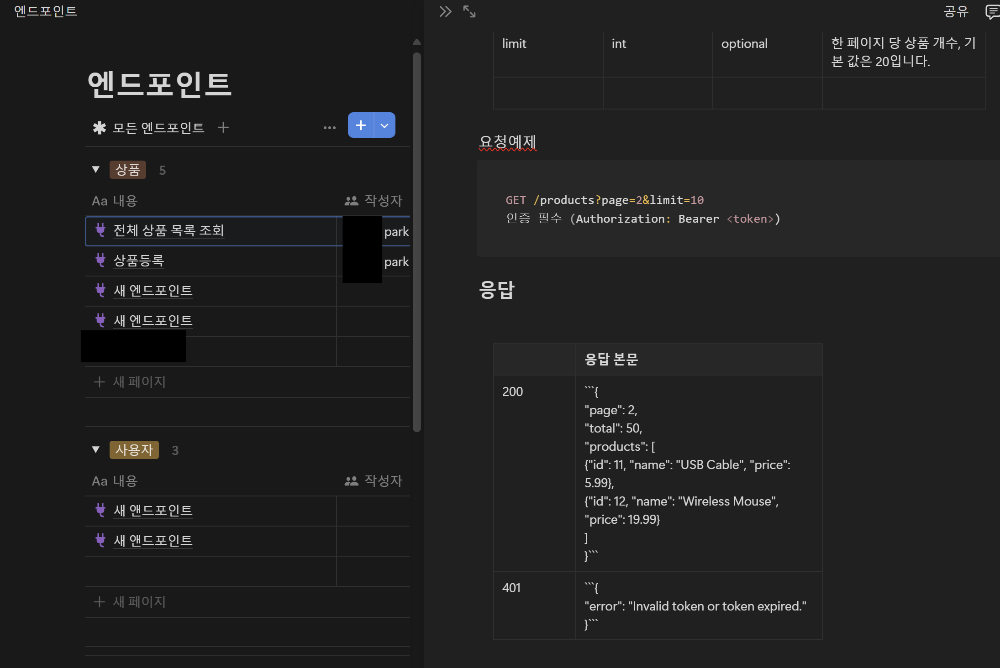

- 엔드포인트가 핵심이다.
- Token은 필수적이다.

## 1. API란 무엇인가?

- **API(Application Programming Interface)**는 소프트웨어와 소프트웨어 사이를 잇는 인터페이스로, 프로그램이나 서비스가 다른 프로그램이나 서비스를 활용할 수 있도록 정의된 일련의 규칙, 명세, 프로토콜을 의미한다.
- 쉽게 말해, API는 두 소프트웨어가 서로 "대화"하는 데 사용되는 공통 언어이자 약속, 소프트웨어 간의 통신 규약이다. (데이터 교환)

### 예를 들어:

- **날씨 앱과 서버:** 스마트폰의 날씨 앱을 실행하면, 앱은 날씨 데이터가 있는 서버에 "오늘 서울의 날씨를 알려주세요."라는 요청을 보낸다. 이 요청 형식과 응답 형식은 사전에 API를 통해 정해져 있다. 서버는 정해진 규칙에 따라 JSON 형식 등으로 응답을 보내고, 앱은 그 응답을 해석해 화면에 날씨를 표시한다.

- **소셜 로그인:** 웹사이트에서 "구글 계정으로 로그인" 버튼을 누르면, 사이트는 구글 API를 통해 사용자 정보를 요청한다. 사이트와 구글 간에 이 정보가 오고 가는 형식, 인증 절차 등도 API로 정의된다.

요약하자면, API는 "**소프트웨어 간 통신 규칙**"이며, 이를 통해 각기 다른 서비스나 프로그램들이 효율적이고 표준화된 방법으로 상호작용할 수 있다.

----

## 2. 왜 API 문서화가 필요한가?

API 문서화는 API를 제공하는 측과 이를 사용하는 개발자 간의 "**사용 설명서**" 역할을 한다. API 문서가 없다면 외부 개발자나 팀 내 다른 구성원은 API가 어떤 요청을 받고 어떤 응답을 주는지, 파라미터나 응답 필드의 의미가 무엇인지 알기 어렵다.

### 문서화의 핵심 당위성:

1. **이해도 향상 및 개발 효율성 증대:**
    명확하게 정리된 문서를 통해 API를 처음 접하는 개발자도 빠르게 이해하고 활용할 수 있다. 이는 불필요한 시간 낭비를 줄여주고, 개발 속도를 높여준다.
    
2. **오류 감소 및 유지보수 용이성:**
    API 사용법을 분명히 정의하면 요청이나 응답 형식, 파라미터 범위에 대한 혼동이 줄어든다. 이는 개발자가 올바른 방식으로 API를 호출하게 하고, 잘못된 사용으로 인한 오류를 최소화한다. 또한 API 구조나 응답 형식을 변경할 때, 문서에 해당 내용을 업데이트하면 다른 개발자들이 변경 사항을 쉽게 파악할 수 있어 관리가 용이해진다.
    
3. **일관성 유지 및 표준화:**
    다양한 팀원, 혹은 외부 파트너가 API를 사용하는 경우 모두에게 동일한 기준을 제시하고, 표준화된 방식으로 API에 접근하게 한다. 이는 장기적인 API 발전과 확장에도 유리하다.
    
4. **신뢰성 및 전문성 확보:**
    API 문서가 잘 되어 있으면, 외부 개발자나 고객에게 "이 서비스는 전문적으로 관리되고 있으며 신뢰할 수 있다"는 인상을 준다. 이는 파트너십 확대나 비즈니스 성장에도 긍정적 영향을 미친다.

----


## 3. API 문서화 시 포함해야 할 주요 요소

1. **API 개요 및 설명:**
    
    이 API의 목적, 주요 기능, 사용하는 인증 방식, 버전 정보, 서비스 URL 등을 명시한다.
    
2. **엔드포인트별 상세 정보:**
    
    각 엔드포인트(예: `GET /users`, `POST /users`)에 대해 아래 정보를 제공한다.
    
    - **HTTP 메서드 및 요청 경로:** 예: `GET /items/{item_id}`
    - **요약 및 상세 설명:** 이 엔드포인트가 하는 일, 언제 사용하는지
    - **요청 파라미터:** 쿼리 파라미터, 경로 파라미터, 헤더, 바디(form-data, JSON 등)의 구조와 타입
    - **요청/응답 예제:** 실제 예시 요청과 응답 JSON을 제시
    - **응답 상태 코드:** 200, 400, 404, 500 등 가능한 모든 상태 코드와 그 의미
    - **오류 메세지 및 처리 방식:** 에러 발생 시 응답 포맷

3. **인증/인가 정보:**
    
    JWT, OAuth2.0, Basic Auth 등 어떤 방식으로 인증하는지, 토큰 발급/갱신 방법 등을 설명한다.
    
4. **데이터 모델 설명 기재재:**
    
    응답으로 반환하는 객체들의 필드 타입, 의미, 가능한 값의 범위 등을 명확히 기재한다.
    
5. **버전 정보 및 변경 이력(Change Log):**
    
    API가 업데이트되거나 변경사항이 발생할 때, 버전 관리를 통해 사용자가 변경 내역을 파악할 수 있게 한다.

-----


## API 문서화에 활용할 자료 및 툴

- **OpenAPI / Swagger:**
    
    가장 널리 사용되는 API 명세 포맷. YAML 또는 JSON으로 작성한 뒤 Swagger UI나 ReDoc으로 가독성 높은 문서를 생성할 수 있다.
    
- **Postman Collections:**
    
    Postman으로 API 요청을 정리해둔 컬렉션을 공유하면, 다른 개발자들이 쉽게 요청을 테스트할 수 있으며 Postman 문서화 기능을 통해 웹 문서를 자동 생성할 수 있다.
    
- **Notion ,GitHub Pages:**
    
    마크다운 기반의 문서를 쉽게 웹에 호스팅할 수 있는 서비스들로, 간단한 API 가이드를 정적 문서로 게시할 수 있다.
    
- **Docusaurus, GitBook:**
    
    문서화 전용 플랫폼을 활용해 풍부한 튜토리얼, FAQ, 가이드 등을 추가한 API 문서 포털을 만들 수 있다.


----


## 실제 문서화 예시 구조

### 실제 문서화 샘플 (HTTP/REST API)

- **개요**
    - 이 API는 **사내 재고 관리 시스템**의 상품 정보 조회를 위한 RESTful API이다.
    - 주요 기능: 상품 목록 조회, 상품 상세 조회, 상품 등록/수정/삭제, 사용자 정보 조회, 인증 조회
- **인증/인가**
    - JWT 기반 Bearer 토큰 사용
    - 요청 헤더 예시: `Authorization: Bearer <token>`
- **엔드포인트**
    1. **GET /product**
        - 설명: 전체 상품 목록 조회
        - 요청 파라미터:
            - `page` (int, optional): 페이지 번호, 기본값 1
            - `limit` (int, optional): 한 페이지당 상품 개수, 기본값 20
        - 요청 예제:
        ```
        GET /products?page=2&limit=10
        Authorization: Bearer <token>
        ```

        - 응답 예제 (200 OK):
        ```
        {
            "page": 2,
            "total": 50,
            "products": [
                {"id": 11, "name": "USB Cable", "price": 5.99},
                {"id": 12, "name": "Wireless Mouse", "price": 19.99}
            ]
        }
        ```
        - 에러 사례 (401 Unauthorized):
        ```
        {
        "error": "Invalid token or token expired."
        }
        ```

    2. **GET /products/{id}**
    - 설명: 특정 상품 상세 조회
    - product's'이다.
    - 요청 **경로** 파라미터:
        - `id` (int, required): 상품 고유 식별자
    - 요청 예제제:

        ```    
        GET /products/11
        Authorization: Bearer <token>

        ```
    - 성공 응답 (200 OK):
        ```
        {
            "id": 11,
            "name": "USB Cable",
            "price": 5.99,
            "stock": 150
        }
        ```
    - 에러 응답 (404 Not Found):
        ```
        {
        "error": "Product not found."
        }
        ```

    3. **POST /products**
    - **설명**: 새로운 상품을 등록한다.
    - **요청 '바디' 파라미터 (JSON)**:
        - name (string, required): 상품명
        - price (float, required): 상품 가격
        - stock (integer, optional): 재고 수량 (기본값: 0)
    
    - 요청 예제
        ```
        POST /products
        Authorization: Bearer <token>
        Content-Type: application/json

        {
        "name": "Bluetooth Keyboard",
        "price": 29.99,
        "stock": 100
        }
        ```

    - 성공 응답 (201 Created):
        ```
        {
        "id": 51,
        "name": "Bluetooth Keyboard",
        "price": 29.99,
        "stock": 100
        }
        ```

    - 에러 응답 (400 Bad Request):
        ```
        {
        "error": "Missing required field: name"
        }
        ```

    - 에러 응답 (401 Unauthorized):
        ```
        {
        "error": "Invalid token or token expired."
        }
        ```


    4. **PUT /products/{id}**

    - **설명**: 특정 상품 정보를 수정한다.

    - 1. **요청 '경로' 파라미터**:

        - id (int, required): 상품 고유 식별자

    - 2. **요청 '바디' 파라미터 (JSON)**:

        - name (string, optional): 변경할 상품명
        - price (float, optional): 변경할 상품 가격
        - stock (integer, optional): 변경할 재고 수량

    - 요청 경로 파라미터와 요청 바디 파라미터 둘 다 사용한다.

    - 요청 예제:
        ```
        PUT /products/11
        Authorization: Bearer <token>
        Content-Type: application/json

        {
        "price": 4.99,
        "stock": 200
        }
        ```

    - 성공 응답 (200 OK):
        ```
        {
        "id": 11,
        "name": "USB Cable",
        "price": 4.99,
        "stock": 200
        }
        ```

    - 에러 응답 (400 Bad Request):
        ```
        {
        "error": "Invalid price format."
        }
        ```

    - 에러 응답 (404 Not Found):
        ```
        {
        "error": "Product not found."
        }
        ```

    5. **DELETE /products/{id}**

    - **설명**: 특정 상품을 삭제한다.
    - 아이디만 필요!

    - **요청 경로 파라미터**:

        - id (int, required): 상품 고유 식별자

    - 요청 예제:
        ```
        DELETE /products/11
        Authorization: Bearer <token>
        ```

    - 성공 응답 (204 No Content):

        - 바디 없음

    - 에러 응답 (404 Not Found):
        ```
        {
        "error": "Product not found."
        }
        ```
    - 에러 응답 (401 Unauthorized):
        ```
        {
        "error": "Invalid token or token expired."
        }
        ```

    6. **GET /products/search**

    - **설명**: 상품명을 기준으로 상품을 검색한다. 부분 일치 검색을 수행한다.

    - **요청 쿼리 파라미터**:

        - q (string, required): 검색할 문자열
        - page (int, optional): 페이지 번호, 기본값 1
        - limit (int, optional): 한 페이지당 상품 개수, 기본값 20

    - 요청 예제:
        ```
        GET /products/search?q=mouse&page=1&limit=5
        Authorization: Bearer <token>
        ```
    - 성공 응답 (200 OK):
        ```
        {
        "page": 1,
        "total": 3,
        "products": [
            {"id": 12, "name": "Wireless Mouse", "price": 19.99, "stock": 50},
            {"id": 22, "name": "Gaming Mouse", "price": 35.99, "stock": 25},
            {"id": 45, "name": "Mouse Pad", "price": 8.99, "stock": 200}
        ]
        }
        ```
    - 에러 응답 (400 Bad Request):
        ```
        {
        "error": "Missing required query parameter: q"
        }   
        ```


    7. **POST /auth/login**

    - **설명**: 사용자 인증을 통해 JWT 기반 Bearer 토큰을 발급한다.

    - **요청 바디 파라미터 (JSON)**:

        - username (string, required): 사용자 이름 또는 이메일
        - password (string, required): 사용자 비밀번호

    - 요청 예제:
        ```
        POST /auth/login
        Content-Type: application/json
        
        {
        "username": "johndoe@example.com",
        "password": "mypassword"
        }
        ```

    - 성공 응답 (200 OK):
        ```
        {
        "access_token": "eyJhbGciOiJI...<생략>...0SI6IkpXVCJ9",
        "token_type": "Bearer",
        "expires_in": 86400  // 토큰 유효기간(초) 예: 24시간
        }
        ```

    - 에러 응답 (401 Unauthorized):
        ```
        {
        "error": "Invalid username or password."
        }
        ```

    - 에러 응답 (400 Bad Request):
        ```
        {
          "error": "Missing required fields: username, password"
        }
        ```

    8. **GET /users**

    - **설명**: 전체 사용자 목록을 조회한다. 관리자가 사용자를 관리하기 위한 용도로 사용된다.

    - **요청 파라미터 (옵션)**:

        - page (int, optional): 페이지 번호 (기본값: 1)
        - limit (int, optional): 한 페이지 당 사용자 수 (기본값: 20)

    - 요청 헤더 예제:
        ```
        GET /users?page=2&limit=10
        uthorization: Bearer <token>
        ```

    - 성공 응답 (200 OK):
        ```
        {
        "page": 2,
        "total": 45,
        "users": [
            {
            "id": 11,
            "username": "jane.doe",
            "email": "jane.doe@example.com",
            "role": "user"
            },
            {
            "id": 12,
            "username": "michael",
            "email": "michael@example.com",
            "role": "admin"
            }
        ]
        }
        ```

    - 에러 응답 (401 Unauthorized):
        ```
        {
          "error": "Invalid token or token expired."
        }
        ```

    9. **GET /users/{id}**

    - **설명**: 특정 사용자의 상세 정보를 조회한다. 주로 관리자나 본인 확인 용도로 사용된다.

    - **요청 경로 파라미터**:

        - id (int, required): 사용자 고유 식별자

    - 요청 헤더 예제:
        ```
        GET /users/11
        Authorization: Bearer <token>
        ```
    - 성공 응답 (200 OK):
        ```
        {
        "id": 11,
        "username": "jane.doe",
        "email": "jane.doe@example.com",
        "role": "user",
        "created_at": "2023-01-15T10:05:32Z",
        "last_login": "2023-06-10T08:23:45Z"
        }
        ```
    - 에러 응답 (404 Not Found):
        ```
        {
        "error": "User not found."
        }
        ```
    - 에러 응답 (401 Unauthorized):
        ```
        {
        "error": "Invalid token or token expired."
        }
        ```

----
## 엔드포인트 작성
notion 등 개인 페이지를 만들어, 엔드포인트로 정리하면 검토하는 내 자신 뿐만 아니라, 이를 보는 상대방도 빠른 확인이 가능하다.

