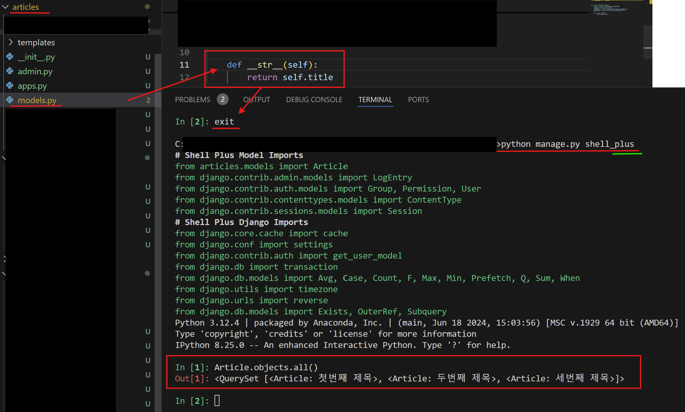

### ORM
 **O**bject-**R**elational-**M**apping, 객체 관계형 맵핑이다.

- 쉽게말해서 파이썬으로 데이터베이스를 조작할 수 있게 해준다.
- 객체 지향 언어에서는 클래스를 이용한 객체로 데이터와 기능을 캡슐화해서 다루고 데이터베이스는 테이블과 행으로 데이터를 저장하고 관리하는데 
이 두가지 사이의 개념적인 간극을 줄인 것이다.
- 즉, SQL 안쓰고 Python으로 데이터베이스 조작할 수 있다.

- Django ORM만 있는건 아니고 여러 가지가 존재한다.
    - Python - Django ORM, SQLAlchemy, Tortoise ORM …
    - JAVA - JPA, Hybernate **…**
    - Node.js - Sequalize …


- ORM이 중간에서 역할을 한다.
    - SQL Statement ↔ **ORM** ↔ Python Object 

- ORM 장점
    1. SQL을 잘 알지못해도 DB 조작 가능
    2. SQL을 알아도 기존의 복잡한 쿼리문 작성없이 객체 지향적인 접근 가능
    3. SQL을 잘사용하지 못한다면 ORM이 변환해주는 것이 더 빠름
    4. 생산성 높음

- ORM 단점
    1. ORM에서 지원하지 않는 쿼리라면 직접 작성해야함
    2. 서비스가 커질수록 ORM만으로는 한계가 있을 수 있음
    3. 매우 효율적인 SQL을 작성하고 싶다면 ORM이 불편할 수 있음
    
    → 현재의 개발은 생산성이 정답인 경우가 많다.
    


---

### Database API

#### database api
Django ORM으로 Database API를 사용해서 데이터베이스를 조작하는 것이다.
- 다른말로 database-abstraction API 라고도한다.

#### Manager
- 모델 클래스를 생성하면 Django는 자동적으로 CRUD 할 수 있는 Database API를 제공한다.
- 정식 이름은 'Django ORM Manager'
- 작성한 모델 클래스를 이용하여 데이터 베이스 쿼리작업을 도와주는 역할을 한다.
- Manager를 이용해서 Django ORM의 Queryset API를 사용하게된다.
    - Queryset == ORM을 사용해서 데이터베이스로부터 전달받은 객체이다.
- 이 매니저의 기본(default)이름은 `objects` 이다.


----


### Django Shell

Django가 제공하는 여러가지 기능을 명령어로 입력해서 실행해볼 수 있는 Shell 환경을 말한다.

- `manage.py` 로 그 파일자체가 아니라 여러가지 환경을 열어주는 것이다.
    - 즉, django 프로젝트 환경이 필요하다.
    == `python manage.py shell` 현재 Django 프로젝트 환경을 Shell로 접근할 수 있게 해준다.


1. `python manage.py shell`로 실행한다.


2. 그때그때마다 모델을 다 불러와서 사용하기 불편하기에, '익스텐션' 몇 가지를 설치해서 효율적으로 사용하면 된다. (새로운 터미널)

`pip install django-extensions`
`pip install ipython`


3. 파이썬 새로운 패키지를 설치했으니, `pip freeze > requirements.txt`를 작성한다.
4. requirements.txt에 설치한 버전들이 나오는 것을 볼 수 있다.


---

#### 1. django-extensions
- Django 기본 Shell보다 더 많은 기능이 있는 shell_plus를 제공한다.
- **한 가지 설정이 필요**한데, 이는 **setthings.py 앱등록**이다.


- **앱등록에 추가할 때는 '_(언더바)'이다.** 
- '-'와 '_' 사용을 주의하자.

#### 2. ipython
- python 기본 Shell에 여러가지 기능을 더한 것이다.
- 자동완성, 코드 색상 강조 기능, 실행했을 때 몇 초 걸리는지 등


---
5. 이제 다시 실행을 해본다. 앱을 설치해줬기에 다음과 같이 작성한다.
 `python manage.py shell_plus`
 - django에 있는 모든 Model, Class를 다 import


----

### CRUD(Create, Read, Update, Delete) with Shell
- 게시글을 작성하고(**C**reate) 조회하고(**R**ead) 수정하고(**U**pdate) 삭제한다(**D**elete)

- 우리가 사용하는 서비스의 대부분이 CRUD로 이루어져 있다.
- **C**reate, **R**ead, **U**pdate, **D**elete

- 대부분의 소프트웨어가 하는일이이다.

- Django ORM으로 CRUD를 해보는 것이 목표이다.

---

#### 기본 형태


- Model Class . Manager . QuerysetAPI
- 아직 따로 무언갈 만들지 않았다면 조회결과가 비어있는 게 정상이다.

---
#### 1. 전체 Article 조회


Queryset이란? : 데이터베이스에서 ORM 조회했을 때 나오는 데이터들의 객체
    - 반복 가능한 객체(iterable)
        - for i in queryset 가능
    - 리스트처럼 접근 가능(인덱스 접근 가능)

데이터가 비어있으니([]내부가 비어있으니) 데이터를 넣어야한다.


#### 2. 하나의 Article 생성하기


##### 2-1. Article 생성1
```
article = Article()
article.title = 'first_title'
article.content = 'my_content'

# 여기에서 전체 Article을 조회해보면
Article.objects.all() # 비어있다

# save()하기전에는 저장되지 않음
article.save() # 저장장

# 다시 전체 Article을 조회해보면 하나의 아티클이 있음
Article.objects.all()
```


하나의 조회된 객체가 리스트 안에 들어가 있는 것을 확인할 수 있다.

아래 속성들도 접근 가능하다.

```
# 속성 하나씩 접근하기
# 제목 
article.title

# 내용
article.content

# 생성일시
article.create_at

# pk(id)
article.id
```


##### 2-2.Article 다른 방법 생성2
코드를 한 줄로 표현할 수 있다.


##### 2-3. Article 다른 방법 생성3
Manager를 통해 표현할 수 있다.
- Save를 하지 않아도, 자동적으로 저장됨.


---
##### 2-4. __str__ 이용하기
 `__str__` : 어떤 Class를 문자열처럼 취급했을 때, 어떻게 보여질 지 결정하는 매직 메서드 

아래 터미널에 적혀있는 것이 `__str__` 매직 메서드에 보여지는 것들이다.

- Migration 해줘야하나요? -> 아니다
    - 데이터베이스에 변경될 상황이 생길 때 Migration을 해주는데, `__str__` 는 데이터베이스가 변경된 것이 아니라 python class 문법이라 영향이 없다.

- article의 models.py 에 추가적으로 아래 두줄을 작성해주면, 다음과 같은 article의 model.py 코드가 작성된다.
```
class Article(models.Model):
    title = models.CharField(max_length=50)
    content = models.TextField()
    created_at = models.DateTimeField(auto_now_add=True)
    updated_at = models.DateTimeField(auto_now=True)

    def __str__(self):
        return self.title
```

- 기존 터미널 exit 후 다시 터미널 켜서 조회해보면(`Article.objects.all()`), `self.title`한 것이 바로 보여진다.



---

#### 3. 모두 조회하기
```
Article.objects.all()
```

---
#### 4. 하나의 article만 조회하기
```
Article.objects.get(id=1)
```
- get은 Queryset이 나오는 것이 아니라, 객체로 나온다.

- get은 딱 1개의 조회가 필요할 때 사용한다.
- 조건에 해당하는 객체가 없다면, DoesNotExist 예외를 발생시킨다.(터진다는 소리와 동일하다.)
- 한 개 이상의 객체가 리턴될 경우도 MulipleObjectReturned 예외를 발생시킨다. (터진다는 소리와 동일하다.)
즉, get은 진짜 1개만 조회할 수 있다.

- 예외 발생 에러
```
Article.objects.get(content='my_content') # 두 개 리턴되어 에러
```

---
#### 5. 조건으로 조회하기

```
Article.objects.filter(content='my_content')
```
filter()내 내용들을 모두 다 가지고 오는 **Queryset API**이다.

조건에 사용되는 매개변수, 즉 '()' 내에 작성된 것을 **lookup**이라고 부른다. 
- lookup과 일치하는 객체를 모두 리턴한다.

- 당연히 다양한 lookup을 django는 제공한다.

```
Article.objects.filter(id__gt=2) # 2보다 큰 id
Article.objects.filter(id__in=[1,2,3]) # 1,2,3에 속하는 id
Article.objects.filter(content__contains='my') # content에 'my'가 포함된
...
```
- 공식문서 (https://docs.djangoproject.com/en/4.2/topics/db/queries/#field-lookups)


**일치하지 않는다면 빈 쿼리셋을 리턴**한다.

---
#### 6. 수정하기
- 수정하기는 아래의 단계를 따른다.
    1. 수정할 객체를 조회
    2. 수정할 내용을 입력
    3. 수정한 것을 데이터베이스에 반영
```
article = Article.objects.get(id=1)
article.title = 'updated title'
article.save()
```


- Queryset을 리스트처럼 사용가능하기에, **get말고도 for문도 가능**해서 각각 나타낼 수 있다.
---
#### 7. 삭제하기
- 삭제할 대상을 골라 삭제한다.
```
article = Article.objects.get(id=2)
article.delete()
```
