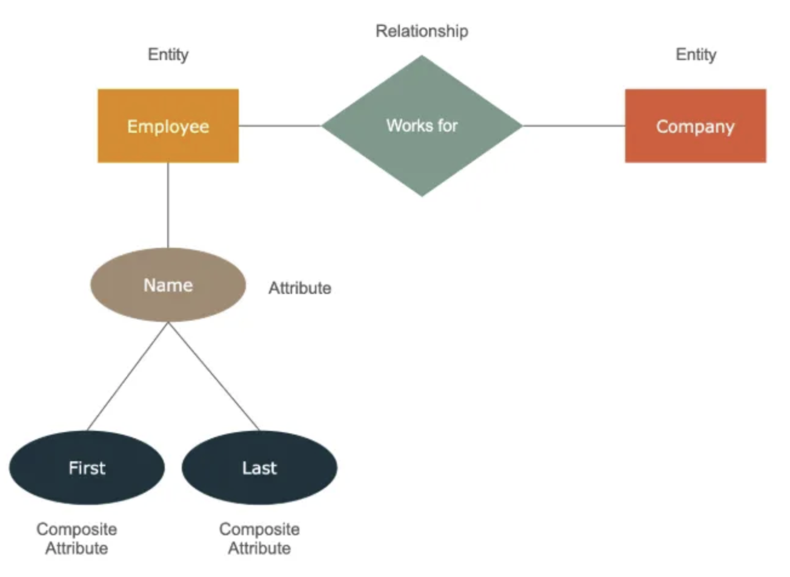

## 1. ERD(Entity-Relationship Diagram)?

- **ERD**는 **개체(Entity)**, **개체 간의 관계(Relationship)**, 그리고 **개체의 속성(Attribute)**을 시각적으로 표현한 다이어그램이다.

---

## 2. ERD의 필요성

- **데이터베이스 설계 과정**에서 핵심적인 역할을 하는 도구

1. **비즈니스 요구사항의 체계적 이해**
    - ERD를 작성하는 과정은 비즈니스 요구사항을 분석하고, 관리 대상이 되는 객체(개체)와 그들 사이의 관계를 명확히 파악 가능
    - 애매모호한 부분을 줄여 비개발자(기획자, 의사결정권자)와 개발자 사이의 원활한 커뮤니케이션
2. **데이터 구조의 시각화**
    - 복잡한 데이터 구조를 직관적으로 이해 가능(어떤 개체 ? 어떤 관계? 어떤 속성?)
3. **정규화와 무결성 확보**
    - ERD를 기반으로 **데이터 정규화**를 진행 - **데이터 중복**과 **이상 현상**을 방지
    - 각 개체 간 **참조 무결성**(어떠한 내용이 바뀌면 연결된 내용도 같이 바뀌어야한다)을 확보
4. **개발 및 유지보수 편의성 향상**
    - 실제 구현 시 테이블 구조를 확정하고, 외래 키(Foreign Key)와 인덱스(Index)를 설정할 때 참조할 근거
    - 데이터베이스 구조를 체계적으로 관리하고 수정할 수 있어 유지보수와 확장성을 크게 개선

- **데이터 정규화(Data Normalization)란?**

    **데이터 정규화**는 데이터베이스 테이블을 설계할 때, 데이터를 중복 없이 체계적으로 분해하고 정리하는 과정이다.

    이를 통해 데이터 구조를 단순화하고, 불필요한 중복을 제거하며, 논리적 안정성과 일관성을 확보할 수 있다. 

    정규화는 일반적으로 아래와 같은 이유로 수행한다.

    1. **중복 최소화**: 동일한 정보가 여러 테이블이나 칼럼에 중복되어 있으면, 하나의 데이터를 변경할 때마다 모든 중복되는 곳을 수정해야 하는 비효율이 발생합니다. 정규화를 통해 이러한 중복을 줄일 수 있다.
    2. **데이터 무결성 유지**: 정규화를 통해 데이터가 잘못되거나 불일치한 상태로 들어가는 것을 예방할 수 있다.
    3. **이상현상 최소화**: 정규화는 아래에 설명될 이상현상을 방지하거나 최소화하는 중요한 역할을 한다.

    대표적인 정규형으로 1정규형(1NF), 2정규형(2NF), 3정규형(3NF) 등이 있으며, 점차 상위 단계의 정규형으로 갈수록 데이터 구조가 더 세분화되고 엄밀해지는 특징이 있다.

---
- **데이터 이상현상(Data Anomalies)란?**

    **데이터 이상현상**은 데이터베이스 설계가 비합리적으로 이루어져 있을 때, 데이터 삽입(Insert), 수정(Update), 삭제(Delete) 과정에서 발생하는 비정상적이고 부정적인 결과를 의미한다.

    주요 이상현상은 다음과 같다.

    1. **삽입 이상(Insert Anomaly)**: 새로운 데이터를 삽입하려 할 때, 다른 불필요한 데이터도 함께 삽입해야 하는 비효율적인 상황을 말한다. 예를 들어, 어떤 테이블이 과도하게 많은 정보를 담고 있어, 단순히 “새로운 과목”을 등록하기 위해 “학생 정보”까지 동시에 입력해야 하는 경우다.
    2. **갱신 이상(Update Anomaly)**: 동일한 정보가 여러 장소에 중복되어 있어, 한 곳의 데이터를 변경한 뒤 다른 곳도 모두 변경해야 하는 상황이다. 변경을 깜빡하고 한 곳만 수정하면 데이터 불일치가 발생한다.
    3. **삭제 이상(Delete Anomaly)**: 한 정보를 삭제할 때 의도치 않게 관련된 다른 정보도 함께 사라지는 상황이다. 예를 들어, 어떤 과목과 학생 정보가 한 테이블에 섞여 있고, 한 학생의 수강 기록을 삭제하려다 보니 그 학생에 대한 모든 정보가 사라져 버리는 문제가 발생할 수 있다.

    이러한 이상현상은 데이터 정규화를 통해 크게 줄일 수 있습니다.

---

- **### 참조 무결성(Referential Integrity)이란?**

    **참조 무결성**은 테이블 간의 관계를 맺는 외래키(Foreign Key)가 항상 유효한 값을 유지하도록 보장하는 데이터 무결성 규칙이다. 

    쉽게 말해, 한 테이블에서 다른 테이블을 참조할 때(외래키 관계), 참조 대상이 유효한 레코드(행)를 반드시 가져야 한다는 것이다.

    - [예시]

    **주문(Order)** 테이블이 **고객(Customer)** 테이블을 참조한다고 할 때, 주문 테이블의 Customer_ID 칼럼은 반드시 Customer 테이블에 존재하는 Customer_ID를 가리켜야한다. 만약 Customer 테이블에서 Customer_ID=100인 고객이 삭제되었는데, Order 테이블에 Customer_ID=100인 주문 기록이 그대로 남아 있다면, 참조 무결성이 깨지게된다. 

    이를 방지하기 위해 외래키 제약 조건을 두어, 참조 대상이 삭제되거나 변경될 때 연쇄적으로 처리(ON DELETE CASCADE, ON UPDATE CASCADE)하거나, 참조 무결성을 위반하는 행위를 아예 막아버린다.

---

## 3. ERD의 기본 구성 요소

### 1. **개체(Entity)**

- 데이터베이스에서 독립적으로 관리할 가치가 있는 "대상"을 의미 **OR** 업무에서 관리하고자 하는 실체
- 데이터베이스에서 테이블 단위로 표현
- 예를 들어, ‘**고객**’, ‘**주문**’, ‘**상품**’ 등과 같이 실제로 존재하거나 관리 대상인 명사를 떠올리면 된다.

- **자세한 개체 판단 기준**
    - **독립적인 실체성(Existence)**:
        
        해당 대상이 업무나 비즈니스 로직 상 독립적으로 존재하며, 다른 대상 없이도 식별이 가능한가를 확인한다. 즉, 그 자체로 하나의 테이블(혹은 데이터 집합)로 관리할 가치가 있어야 한다.
        
    - **고유한 식별자(Identifier) 보유 여부**:
        
        해당 대상에 고유한 식별자(Primary Key)로 삼을 만한 속성이 있는지 확인한다. 예를 들어, ‘고객’은 고객ID로, ‘상품’은 상품코드로, ‘과목’은 과목코드로 식별할 수 있어야한다.
        
    - **속성(Attribute) 집합의 존재**:
        
        대상에 여러 속성이 따르며, 이 속성들이 해당 대상을 상세히 표현하고 관리할 필요가 있는지를 살핀다. 만약 어떤 대상이 단 하나의 속성만 갖거나 별도의 특징을 관리할 필요가 없다면, 굳이 개체로 만들지 않고 상위 개체의 속성으로 처리할 수 있다.
        
    - **비즈니스 의미와 관리 필요성**:
        
        해당 대상을 데이터베이스로 관리함으로써 얻을 수 있는 비즈니스 가치를 고려한다. 이 대상이 업무 상 중요한 정보를 담고 있거나, 다른 개체와의 관계를 통해 의미 있는 통계나 로직을 구축하는 데 필수적이라면 개체로 삼을 가치가 있다.
        
    - **다른 개체와 관계성(Relationship) 판단**:
        
        해당 대상이 다른 개체와의 관계(1:1, 1:N, M:N)를 형성하고 있어야한다. 대체로 개체는 다른 개체와 관계를 맺음으로써 데이터베이스 설계 전체에서 의미를 갖게 된다.
        
        반면 관계 없이 고립되고, 속성도 거의 없으며 관리 필요성도 없다면, 개체로 식별하기 어렵다.

- **개체 관련 문제**
    
    ### 문제 1
    
    다음 상황에서 데이터베이스로 관리하고자 하는 대상을 ‘개체(Entity)’로 식별하시오.
    
    - 한 온라인 서점은 다음 정보를 관리하려고 한다.
        - 고객의 정보(이름, 이메일, 주소 등)
        - 판매하는 서적 정보(ISBN, 책 제목, 저자, 출판사 등)
        - 고객이 만든 주문 정보(주문 번호, 주문 날짜, 총 금액)
        - 주문에 포함된 각 서적의 상세 정보(해당 서적, 수량, 단가)
    
    - **정답:**

        - Customer(고객)
        - Book(서적)
        - Order(주문)
        - Order_Detail(주문 상세)

        **해설:**

        ‘개체’란 데이터베이스에서 관리하고자 하는 실체를 의미한다. 

        1. **고객(Customer**) : 고객ID나 이메일로 식별될 수 있고, 여러 속성(이름, 주소, 연락처)이 존재하므로 개체로 관리할 가치가 있다. 
        2. **책(Book)** : 식별자(ISBN)와 여러 속성(제목, 저자, 출판사)이 있어 개체화하기 적합하다. 
        3. **주문(Order)** 은 주문 번호를 통한 식별이 가능하며, 주문 날짜나 총 금액 같은 속성이 따르므로 개체가 된다. 
        4. **주문 상세(Order_Detail)** 역시 주문과 책의 M:N 관계 해소를 위해 필요한 별도 개체로, 수량이나 단가 등의 속성을 가지므로 독립 개체로 관리할 수 있다.

    ### 문제 2

    - 한 대학교의 수강 관리 시스템에서 다음 요구사항을 바탕으로 개체를 식별하시오.

      - 학생(Student)은 여러 강좌(Course)를 수강할 수 있다.
      - 강좌는 여러 교수(Professor) 중 한 명이 강의한다.
      - 각 강좌는 매 학기(Semester)마다 개설된다.
      - 학생들은 해당 학기에 개설된 강좌를 선택해 수강 신청(Enrollment)한다.   

      **정답:**
        - Student(학생): 학생ID를 식별자로 하고, 이름, 전공, 학번 등 여러 속성을 관리할 수 있다.
        - Professor(교수): 교수ID를 식별자로 하고, 이름, 연구분야, 소속학과 등 속성이 존재.
        - Course(강좌): 과목코드 등으로 식별하며, 강좌명, 학점, 개설학과 등의 속성을 관리.
        - Semester(학기): 학기ID(예: 2024-1학기)로 식별하며, 시작일, 종료일, 등록기간 등 관리 가능.
        - Enrollment(수강기록): 학생과 강좌 간 관계를 연결하는 개체로, 수강신청ID, 성적, 수강상태 등의 속성을 가질 수 있다.

        **해설:**

        개체는 독립적으로 관리할 필요가 있는 실체를 의미한다. 
        학생, 교수, 강좌, 학기는 각각 개별적으로 식별 가능하고 여러 속성을 지닌다.
        또한 학생과 강좌 사이의 다대다(M:N) 관계를 해소하기 위해 Enrollment와 같은 중간 테이블(개체)을 두어 수강 기록을 명확히 관리할 수 있다.
        이것들은 모두 데이터베이스로 관리하는 데 적합한 개체 후보들이다. 

----

### 2. 속성(**Attribute)**

- 해당 개체가 갖는 특성이나 정보
- 데이터베이스에서 칼럼(Column)으로 표현
- 예를 들어, ‘고객’ 개체는 **‘고객ID’, ‘이름’, ‘연락처’, ‘주소’**와 같은 속성을 가질 수 있습니다.
- 개체의 속성 중에는 특정 행을 유일하게 식별하거나, 개체 간의 관계를 형성하는 데 사용되는 **키(Key)** 개념이 중요(대표적으로, **기본키(Primary Key), 왜래키(Foreign Key)**)

- ##### 키(KEY) 종류
    1. **후보키(Candidate Key)**
    - 한 테이블에서 각 행을 유일하게 식별할 수 있는 속성(또는 속성의 집합)이다.
    - 후보키는 중복 값이 없어야 하며(유일성), NULL 값을 가져서는 안 된다.
    - 하나의 테이블에는 여러 후보키가 존재할 수 있는데, 이 중 하나를 골라 주요 식별자로 사용한다.
    2. **기본키(Primary Key) - 중요**
    - 후보키 중에서 해당 테이블의 대표 식별자로 선택된 키다.
    - 기본키는 각 행을 고유하게 식별할 수 있으므로 반드시 유일해야 하고, NULL을 허용하지 않는다.
    - 예: **고객(Customer)** 테이블의 `Customer_ID`, **상품(Product)** 테이블의 `Product_Code` 등.
    - 기본키를 통해 데이터베이스 엔진은 특정 행을 식별, 검색, 업데이트, 삭제 등 다양한 연산을 효율적으로 수행한다.
    3. **대체키(Alternate Key)**
    - 후보키 중 기본키로 선택되지 않은 나머지 후보키다.
    - 대체키도 기본키와 마찬가지로 유일성과 무결성을 갖지만, 대표 식별자 역할은 기본키가 담당하므로 보조적인 식별자 역할을 한다.
    4. **외래키(Foreign Key) - 중요**
    - 한 테이블의 칼럼이 다른 테이블의 기본키(또는 후보키)를 참조하는 경우, 이 칼럼을 외래키라고 한다.
    - 외래키는 두 테이블 간의 관계(Relationship)를 표현하며, 참조 무결성(Referential Integrity)을 보장한다.
    - 예: **주문(Order)** 테이블에서 `Customer_ID` 컬럼이 **고객(Customer)** 테이블의 `Customer_ID`를 참조한다면, 주문 테이블의 `Customer_ID`는 고객 테이블의 기본키를 참조하는 외래키가 된다.
    5. **복합키(Composite Key)**
    - 두 개 이상의 속성을 합쳐서 하나의 키로 사용하는 경우를 복합키라고 한다.
    - 단일 속성으로는 유일하게 식별하기 어려울 때, 여러 속성을 조합하여 유일성을 확보한다.
    - 예: **수강 기록(Enrollment)** 테이블에서 `(Student_ID, Course_ID, Semester_ID)`를 모두 합쳐야 한 행을 유일하게 식별할 수 있다면, 이 세 속성을 합쳐 복합키를 구성할 수 있다.

-  ##### 키를 설계할 때 고려사항

    1. **유일성(Unique)**:
    
    기본키나 후보키는 테이블 내에서 각 행을 고유하게 식별할 수 있어야한다. 중복된 값이 없어야 하며, NULL을 허용하지 않는다.
    
    . **간결성(Simplicity)**:
    
    가능한 한 키 컬럼은 단순한 속성을 사용하는 것이 좋다. 너무 많은 속성을 합쳐 복합키를 만들기보다는, 단순한 기본키(예: 숫자형 시리얼 ID)를 사용하는 것이 향후 관리와 성능에 유리할 수 있다.
    
    3. **변경 빈도 최소화(Minimal Variability)**:
    
    키로 사용되는 속성은 자주 바뀌지 않는 것이 좋다. 식별자 역할을 하는 기본키가 자주 변경된다면, 관련된 외래키 관계를 가진 다른 테이블의 무결성에도 영향을 미치게된다.
    
    4. **성능(Performance)**:
    
    키는 인덱스를 통해 데이터 접근 속도에 영향을 미친다. 효율적인 키 선정은 데이터 조회, 정렬, 조인 등의 연산을 빠르게 할 수 있게한다.

---

### 3. 관계(Relationship)

- 두 개체 간의 연관성을 나타내며, 한 개체가 다른 개체에 어떻게 연결되는지 표현
- 예를 들어, ‘고객’과 ‘주문’ 간에는 ‘고객이 주문을 한다(Order)’는 관계가 형성 가능

----

### 4. ERD 표현 방법

Simple Diagram은 다음과 같다.

위 사진을 참고하여, 어떤 의미를 어떤 기호로 표현하는 외워두면 다음과 같이 사용이 가능하다.

##### 1) **개체(Entity)**

- **직사각형 상자**로 표현하며, ERD 상에서는 **직사각형 제일 위쪽에 표시**
- 개체명을 **명확**하고 **단수형**으로 작성하는 것이 일반적
- 예: **Customer, Order, Product**

##### 2) 속성(**Attribute)**
- 개체의 특성을 표현하는데, 다양한 방식으로 표현
    1. 동그라미로 표현
    2. 개체 상자 안에 기입
    3. ERD 상에서는 개체명 아래에 나열

- 예시)

    - **Customer: Customer_ID, Name, Phone, Email**
    - **Order: Order_ID, Order_Date, Total_Amount**

##### 3) 관계(Relationship)

- 개체와 개체를 연결하는 선으로 표현
    1. 관계명이나 관계 기호
    2. 마름모형
    3. (글)동사나 동사구로 표현

- 예시)

    - Customer **places** Order (고객이 주문을 한다)
   -  Order **contains** Product (주문 내 제품을 포함한다)

---

### 5. 관계 표현 방법

다음 사진의 어떤 의미를 어떻게 표현하는지 익히게 되면 관련 다이어그램을 보다 수월하게 그릴 수 있다.

- **다양한 예제**
    1. IE - 1:0 ~ N
   

    2. Barker - 1:0 ~ N
 
    3. Peter-Chen : 1:N
 
    4. Peter-Chen : N:M
 
    5. Barker : N : M
 
    6. IE - 다중 테이블
 

    7. 기능들을 여러개 적용

---
### 6. 유용한 툴

이에 유용한 틀은 다음과 같다.

1) Draw.io

2) Lucidchart

**결론 : 프로젝트 규모, 예산, DBMS 종류, 협업 요구사항 등을 고려하여 적합한 툴을 선택해라!**

- **다양한 ERD 툴에 대해서 알고싶다면?**
    
    ##### 1. MySQL Workbench
    
    - **특징**: MySQL 공식 툴로, MySQL 데이터베이스와 쉽게 연동할 수 있다.
    - **장점**:
        - ERD 작성 후 실제 DDL(SQL 스키마) 스크립트를 자동으로 생성하거나 반대로 기존 DB 스키마를 불러와 ERD로 역엔지니어링이 가능하다.
        - 무료로 제공되며, 직관적인 UI를 통해 기본적인 데이터베이스 모델링에 적합하다.
    - **단점**:
        - MySQL에 특화되어 있으므로 타 DBMS와의 호환성이 제한적일 수 있다.

     ##### ### 2. ERwin Data Modeler

    - **특징**: 상용 모델링 툴 중 가장 널리 알려진 제품으로, 대규모 엔터프라이즈 환경에서도 많이 사용된다.
    - **장점**:
    - 다양한 DBMS 지원(Oracle, SQL Server, DB2 등) 및 강력한 모델링 기능 제공.
    - 정규화, 비정규화 지원, 메타데이터 관리, 모델 비교 및 변경 관리 등 고급 기능 보유.
    - 데이터 거버넌스 측면에서 메타데이터 관리, 표준 용어 사전 기능을 갖추어 큰 조직에 유용하다.
    - **단점**:
    - 유료 제품이며, 초보자에게는 다소 복잡하게 느껴질 수 있다.

    ##### 3. ER/Studio Data Architect

    - **특징**: ERwin과 비슷한 급의 상용 전문 ERD 모델링 툴.
    - **장점**:
        - 여러 DBMS 지원, 대형 프로젝트를 위한 풍부한 기능.
        - 모델과 실제 DB 스키마 간 양방향 동기화(Reverse/Forward Engineering) 가능.
        - 협업 기능, 버전 관리, 보고서 생성 기능을 갖추어 팀 단위 작업에 적합.
    - **단점**:
        - 유료 제품으로, 초급 사용자나 소규모 프로젝트에는 비용 부담.  

    ##### ### 4. Lucidchart, Draw.io, Creately 등 클라우드 기반 다이어그램 툴

    - **특징**: 웹 기반으로 ERD뿐만 아니라 다양한 다이어그램 작성에 활용할 수 있는 범용 도구들이다.
    - **장점**:
        - 플랫폼 독립적이며, 인터넷 브라우저만 있으면 협업 가능.
        - 간단한 UI와 공유 기능을 통한 실시간 협업 지원.
    - **단점**:
        - DB 스키마 자동 생성, 역엔지니어링 기능 같은 전문적 기능은 제한적.
        - 주로 시각화에 초점이 맞추어져 있어 대형/복잡 모델 관리에는 제약.     

    ##### ### 5. PgModeler (PostgreSQL 전용)

    - **특징**: PostgreSQL 전용 오픈소스 모델링 툴.
    - **장점**:
        - PostgreSQL에 최적화된 기능을 제공하고, 오픈소스이므로 비용 부담이 적다.
        - PostgreSQL을 주로 사용하는 환경에서 유용.
    - **단점**:
        - 특정 DBMS(PostgreSQL)에 특화되어 있어 타 DBMS 사용 시 활용도가 떨어진다.

    ##### 6. Oracle SQL Developer Data Modeler

    - **특징**: Oracle 공식 모델러 도구.
    - **장점**:
        - Oracle 환경에 최적화되어 있으며, 무료 제공.
        - Logical/Physical 모델링 지원, 자동 스키마 생성, Reverse Engineering 지원.
    - **단점**:
        - Oracle DBMS 이외 환경에서의 활용성은 제한적.

----
**정리하자면**:

- **특정 DBMS 전용(예: MySQL Workbench, PgModeler, SQL Developer Data Modeler)**: 해당 DBMS를 집중적으로 사용하는 프로젝트에 적합.
- **범용 상용 툴(ERwin, ER/Studio)**: 대형 프로젝트나 엔터프라이즈 환경에서 정교한 모델링과 거버넌스를 필요로 할 때 사용.
- **클라우드 기반 다이어그램 툴(Lucidchart, Draw.io)**: 간단한 모델링 또는 초기 개념 모델링 시 편리하고, 협업이 용이하지만 고급 기능은 제한적.

---

### 7. 실습

**서비스 : 간단한 온라인 도서 마켓**
1. 개체와 속성을 먼저 생각하고 작성할 것 

- 개체 : User

    - id(pk)
    - password
    - age
    - username
    - email
    - created_at

- 개체 : Book
    - id(pk)
    - author
    - price
    - stock
    - published_date
    - publisher
    - Category_id (FK)

- 개체 : Book Category
    - id (PK)
    - name

- 개체 : Order
    - id (pk)
    - user_id (fk)
    - order_Date
    - total_price

- 개체 : OrderItem (주문 상세)
    - id (pk)
    - book_id (fk)
    - order_id (FK)
    - quantity
    - price

- 개체 : Review
    - id (pk)
    - user_id (fk)
    - book_id (fk)
    - rating
    - comment
    - created_at

2. 각 개체간의 관계 생각하고 작성할 것

    - User와 order는 1:n 관계
    - order와 orderitem는 1:n
    - book과 orderitem는 1:n
    - book과 category : n:m / n:1
    - user와 review는 1:n
    - book과 review 1:n

3. 결과물
- https://app.diagrams.net/ 을 이용할 것

